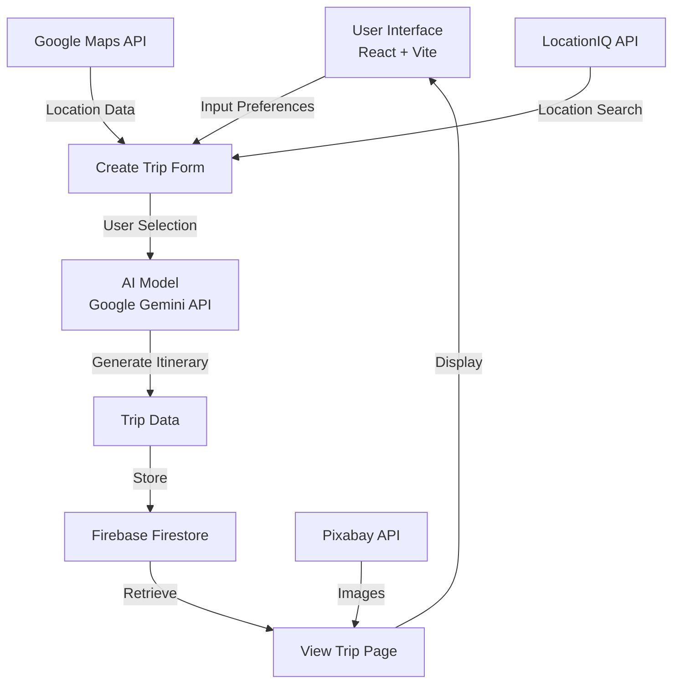

<<<<<<< HEAD
<div align="center">

# 🌍 Fravel - AI Trip Planner

**An intelligent AI-powered travel planning application that creates personalized itineraries in seconds**

[](https://ai.google.dev)
[](https://react.dev)
[](https://vitejs.dev)
[](https://tailwindcss.com)
[](https://firebase.google.com)
[](https://vercel.com)
[](LICENSE)

**[🚀 Live Demo](https://fravel-ai-trip-planner-t2nw.vercel.app)** • **[📧 Contact](#contact)** • **[⭐ Star](#-give-a-star)**

---

</div>

## 🎯 About Fravel

Fravel is a cutting-edge AI travel planning platform that revolutionizes how people plan their vacations. Using advanced artificial intelligence, Fravel generates fully personalized travel itineraries in mere seconds, taking into account your budget, trip duration, travel companions, and preferences.

No more endless hours searching for flights, hotels, and attractions. **Fravel does it all for you.**

---

## 🚀 Features at a Glance

| 🎫 | Feature | Description |
|:---:|---------|-------------|
| 🤖 | **AI-Powered Itineraries** | Generates complete 5-day personalized travel plans with Gemini AI |
| 💰 | **Budget-Smart Planning** | Categorized budget options (Cheap, Moderate, Luxury) |
| 🗺️ | **Global Destinations** | Search and plan trips to any destination worldwide |
| 🏨 | **Hotel Recommendations** | AI-curated hotel suggestions with prices and ratings |
| 📍 | **Places to Visit** | Daily itineraries with attractions, timings, and pricing |
| 👥 | **Group Planning** | Plan trips for solo travelers, couples, families, or groups |
| 🔐 | **Secure Authentication** | Clerk-based secure user authentication |
| 💾 | **Trip Management** | Save, view, and manage multiple trips |
| 🎨 | **Modern UI/UX** | Responsive design with smooth animations |
| 🌓 | **Dark Mode Support** | Dark/Light theme toggle for comfortable viewing |
| 📱 | **Mobile Optimized** | Fully responsive across all devices |
| 🚀 | **Lightning Fast** | Deployed on Vercel with optimized performance |

---

## 🏗️ System Architecture



---

## 🛠️ Tech Stack

<div align="center">

### Frontend


### Backend & Services


### AI & APIs
- **Google Gemini API** - Advanced AI for itinerary generation
- **Clerk** - Secure authentication
- **LocationIQ API** - Location search and autocomplete
- **Google Maps API** - Location verification
- **Pixabay API** - Image sourcing

### Deployment & Tools


</div>

---

## 📊 Technical Highlights

### Frontend Architecture
- **React Hooks** for state management with `useState`, `useEffect`, `useRef`
- **React Router** for seamless navigation
- **Context API** for theme management (Dark/Light mode)
- **Responsive Design** with Tailwind CSS mobile-first approach
- **Component-based** structure for reusability

### AI Integration
- **Gemini API** for intelligent trip itinerary generation
- **Structured Prompts** for consistent, formatted responses
- **Error Handling** with user-friendly notifications via Sonner toast

### Backend & Database
- **Firebase Firestore** for real-time trip data storage
- **Firestore Queries** with Clerk user authentication
- **Secure Data Management** with user email-based filtering

### Performance & UX
- **Vite** for faster development and production builds
- **Lazy Loading** for images and components
- **Debounced Search** for location input optimization
- **Smooth Animations** with Tailwind transitions
- **Dark Mode** with persistent theme preferences

### 📱 Mobile Optimization

Fravel is **fully optimized for all screen sizes** with a comprehensive mobile-first approach:

**Responsive Breakpoints:**
- **Mobile (xs/sm)** - Optimized for phones (320px - 768px)
- **Tablet (md/lg)** - Enhanced for tablets (769px - 1024px)
- **Desktop (xl+)** - Full experience on larger screens (1025px+)

**Key Mobile Features:**
- **Adaptive Typography** - Font sizes scale smoothly: `text-2xl sm:text-4xl md:text-5xl lg:text-6xl`
- **Flexible Grids** - Layouts reflow based on screen size:
  - Budget selection: `1 column (mobile) → 2 columns (tablet) → 3 columns (desktop)`
  - Hotel listings: `1 column (mobile) → 2 columns (tablet) → 3 columns (desktop)`
  - Trip cards: `1 column (mobile) → 2 columns (tablet) → 3 columns (desktop)`
- **Touch-Friendly Interface** - Proper spacing and larger tap targets for mobile users
- **Smart Component Layouts**:
  - Header: Hamburger menu on mobile with smooth transitions
  - Forms: Full-width inputs and stacked layouts on small screens
  - Images: Responsive aspect ratios and full-width on mobile
  - Trip Details: Vertical stacking on mobile → side-by-side on desktop
- **Optimized Padding & Margins** - Consistent spacing that adapts to screen size
- **Mobile-Optimized Typography** - Smaller text on mobile, larger on desktop for readability
- **Responsive Images** - Images scale appropriately without horizontal overflow
- **Fast Loading** - Improved performance for mobile networks
- **Modern UI Components** - Tailwind CSS utility-first approach ensures optimal rendering

---

## 🚀 Getting Started

### Prerequisites
- Node.js (v16 or higher)
- npm or yarn
- Git

### Installation

```bash
# 1. Clone the repository
git clone https://github.com/yourusername/fravel.git
cd fravel/trip-planner

# 2. Install dependencies
npm install

# 3. Set up environment variables
# Create a .env.local file in the trip-planner directory
cat > .env.local << EOF
# Gemini AI
VITE_GEMINI_API_KEY=your_gemini_api_key

# Location Services
VITE_LOCATION_IQ_TOKENS=your_locationiq_token

# Google Maps
VITE_GOOGLE_MAPS_API_KEY=your_google_maps_key

# Clerk Authentication
VITE_CLERK_PUBLISHABLE_KEY=your_clerk_publishable_key

# Firebase
VITE_FIREBASE_API_KEY=your_firebase_key
VITE_FIREBASE_AUTH_DOMAIN=your_firebase_auth_domain
VITE_FIREBASE_PROJECT_ID=your_firebase_project_id
VITE_FIREBASE_STORAGE_BUCKET=your_storage_bucket
VITE_FIREBASE_MESSAGING_SENDER_ID=your_messaging_sender_id
VITE_FIREBASE_APP_ID=your_app_id

# Pixabay
VITE_PIXABAY_API_KEY=your_pixabay_key
EOF

# 4. Run development server
npm run dev

# 5. Open in browser
# Navigate to http://localhost:5173
```

### Build for Production
```bash
npm run build
npm run preview
```

---

## 🎬 How It Works

```
1️⃣  SIGN UP / LOG IN
    └─ Create a secure account with Clerk authentication

2️⃣  CREATE NEW TRIP
    └─ Fill in your preferences:
       • Destination (from LocationIQ autocomplete)
       • Duration (1-5 days)
       • Budget (Cheap, Moderate, Luxury)
       • Travel Companions (Solo, Couple, Family, Group)

3️⃣  AI PROCESSES REQUEST
    └─ Gemini AI analyzes your preferences and generates:
       • Complete daily itineraries
       • Hotel recommendations with prices
       • Attraction visits with timings
       • Budget breakdowns

4️⃣  VIEW YOUR TRIP
    └─ Explore your personalized trip plan:
       • Beautiful destination images
       • Hotel details with Google Maps links
       • Daily plans with attractions
       • Share directly from the app

5️⃣  SAVE & MANAGE
    └─ Store multiple trips in your profile
       • Access anytime from "My Trips"
       • View all your planned adventures
       • Quick trip overview cards
```

---

## 🌟 Key Features Explained

### 🤖 AI-Powered Itinerary Generation
- Advanced Gemini API integration
- Considers all user preferences
- Generates realistic, actionable itineraries
- Natural language processing for smart suggestions

### 💼 Smart Budget Management
- Three tier budget system (Cheap, Moderate, Luxury)
- AI estimates costs for hotels and activities
- Transparent pricing information

### 🗺️ Global Destination Support
- LocationIQ autocomplete for any worldwide destination
- Google Maps integration for verification
- Real locations with actual prices

### 📱 Fully Responsive Design
- Mobile-first approach
- Optimized for phones, tablets, and desktops
- Touch-friendly interface
- Fast load times

### 🔐 Enterprise-Grade Security
- Clerk authentication
- Firebase Firestore security rules
- User data isolation
- No data leaks or unauthorized access

---

## 📊 Project Statistics

<div align="center">

| 📈 Metric | 📊 Value |
|-----------|---------|
| **AI Model Used** | Google Gemini API |
| **Max Trip Duration** | 5 Days |
| **Supported Destinations** | 10,000+ Worldwide |
| **Budget Categories** | 3 (Cheap, Moderate, Luxury) |
| **Travel Types** | 4 (Solo, Couple, Family, Group) |
| **Response Time** | < 10 seconds |
| **Mobile Optimized** | ✅ 100% |
| **Dark Mode** | ✅ Supported |

</div>

---

## 🚀 Live Demo

<div align="center">

### Visit Fravel Now! 🌐

**[🚀 Open Live Application](https://fravel-ai-trip-planner-t2nw.vercel.app)**

Try creating your first AI-generated trip itinerary in seconds!

</div>

---

## 🗺️ Project Structure

```
trip-planner/
├── src/
│   ├── components/
│   │   ├── custom/
│   │   │   ├── Header.jsx          # Navigation header
│   │   │   └── Hero.jsx            # Landing hero section
│   │   └── ui/
│   │       ├── button.jsx
│   │       ├── input.jsx
│   │       ├── ThemeToggle.jsx
│   │       ├── LoadingSpinner.jsx
│   │       └── ProtectedRoute.jsx
│   ├── create-trip/
│   │   └── index.jsx               # Trip creation form
│   ├── my-trips/
│   │   ├── index.jsx               # Trips dashboard
│   │   └── components/
│   │       └── UserTripCardItem.jsx
│   ├── view-trip/
│   │   └── [tripId]/
│   │       ├── index.jsx           # Trip details page
│   │       └── components/
│   │           ├── InfoSection.jsx
│   │           ├── Hotels.jsx
│   │           ├── PlacesToVisit.jsx
│   │           ├── PlaceCardItem.jsx
│   │           └── Footer.jsx
│   ├── context/
│   │   └── ThemeContext.jsx        # Dark mode context
│   ├── service/
│   │   ├── AIModel.jsx             # Gemini API integration
│   │   ├── GlobalApis.jsx          # External API handlers
│   │   ├── firebaseConfig.jsx      # Firebase setup
│   │   └── DemoData.jsx
│   ├── constants/
│   │   └── options.jsx             # Budget and travel options
│   ├── lib/
│   │   └── utils.js
│   ├── styles/
│   │   ├── theme.css               # Theme variables
│   │   └── animations.css
│   ├── App.jsx
│   ├── main.jsx
│   └── index.css
├── public/
│   ├── logo.svg
│   ├── placeholder.jpeg
│   └── Group 1.png
├── vite.config.js
├── tailwind.config.js
├── postcss.config.js
├── package.json
└── README.md
```

---

## 🔐 Environment Variables

Create a `.env.local` file with the following variables:

```env
# Google Gemini AI
VITE_GEMINI_API_KEY=your_key_here

# LocationIQ (Location Search)
VITE_LOCATION_IQ_TOKENS=your_token_here

# Google Maps
VITE_GOOGLE_MAPS_API_KEY=your_key_here

# Clerk (Authentication)
VITE_CLERK_PUBLISHABLE_KEY=your_key_here

# Firebase Configuration
VITE_FIREBASE_API_KEY=your_key_here
VITE_FIREBASE_AUTH_DOMAIN=your_domain_here
VITE_FIREBASE_PROJECT_ID=your_project_id_here
VITE_FIREBASE_STORAGE_BUCKET=your_bucket_here
VITE_FIREBASE_MESSAGING_SENDER_ID=your_sender_id_here
VITE_FIREBASE_APP_ID=your_app_id_here

# Pixabay (Images)
VITE_PIXABAY_API_KEY=your_key_here
```

---

## 🔄 Deployment with Vercel

<div align="center">

### One-Click Deploy

[](https://vercel.com/new)

</div>

**Manual Steps:**
1. Push your code to GitHub
2. Connect your GitHub repo to Vercel
3. Add environment variables in Vercel dashboard
4. Deploy automatically on every push

---

## 🤝 Contributing

We welcome contributions! Here's how you can help:

1. **Fork** the repository
2. **Create** a feature branch (`git checkout -b feature/amazing-feature`)
3. **Commit** your changes (`git commit -m 'Add amazing feature'`)
4. **Push** to the branch (`git push origin feature/amazing-feature`)
5. **Open** a Pull Request

---

## 🙏 Acknowledgments

<div align="center">

Special thanks to:

- **Google Gemini API** - For powerful AI capabilities
- **Firebase** - For reliable real-time database
- **Vercel** - For seamless deployment
- **Clerk** - For secure authentication
- **Tailwind CSS** - For beautiful styling
- **React Community** - For amazing tools and libraries

</div>

---

<div align="center">

## ⭐ Give a Star!

If you find this project useful or interesting, please consider giving it a star! Your support means a lot to us and helps the project grow.

**[⭐ Star on GitHub](https://github.com/yourusername/fravel)**

---

### Made with ❤️ by the Fravel Team

```
   ______  _____             __  _
  |  ____||  __ \     /\    |  \| |
  | |__   | |__) |   /  \   | |\  |
  |  __|  |  _  /   / /\ \  | | \ |
  | |     | | \ \  / ____ \ | |  \|
  |_|     |_|  \_\/_/    \_\|_|   \_

  FRAVEL - Your AI Travel Companion
```

**Happy Travels! 🌍✈️🗺️**

</div>
=======
# Trip-Planner
>>>>>>> 77f9e76f96c67cecdd2ec461e23dc683e92b80a5
